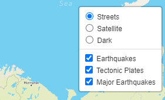
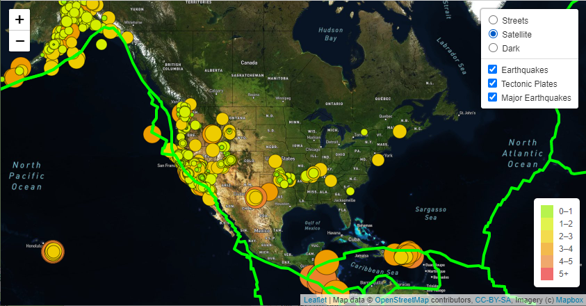
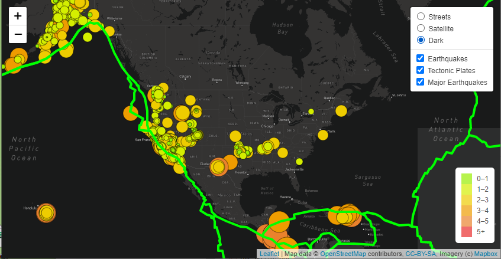
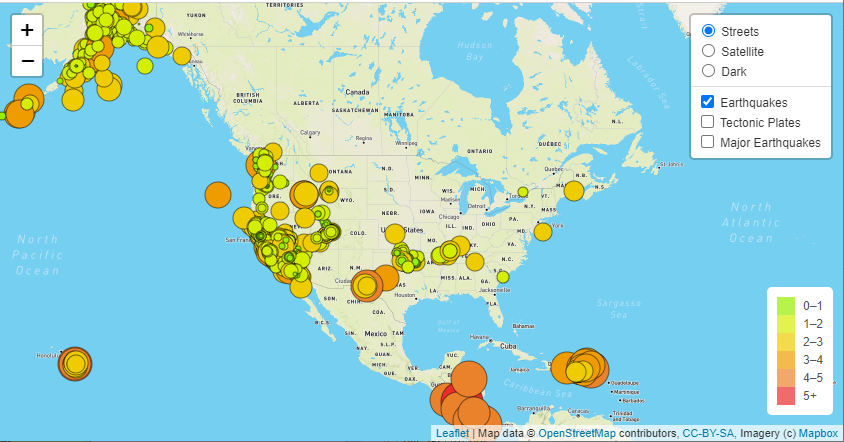
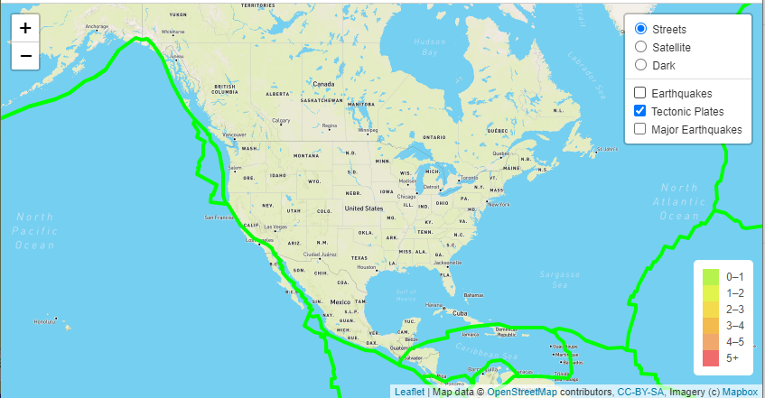
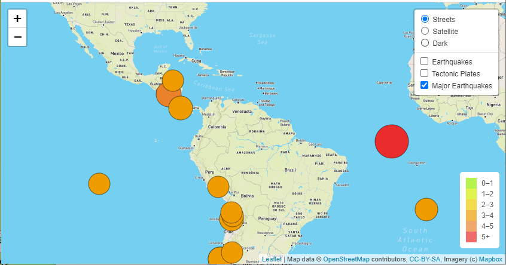

# Module 13 Challenge - Mapping Earthquakes
## Overview of Project
Through the use of Leaflet (https://leafletjs.com/reference.html), JavaScript and external live JSON data (https://earthquake.usgs.gov/earthquakes/feed/v1.0/geojson.php), interactive maps were created.

## Project Details
### Layer Selection
The map enables to decide which type of map to use and what layers of data should be presented.

### Map Types (Streets, Satellite, and Dark Maps)

### Data Layers
There are three (3) types of layers of data to choose form. You can view them all at the same time or view them independently.

Earthquakes that have occurred during the past seven (7) days.

Display of current tectonic plates.

Display of major earthquakes with magnitudes of 4.5 or greather.

